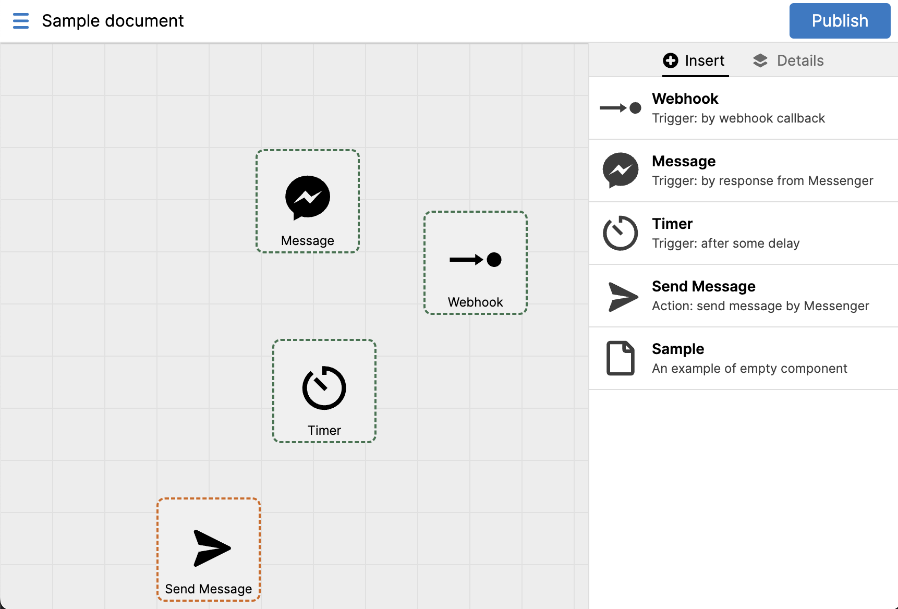

# Review Bot (rbot)

Review Bot is a chatbot for business owners to connect with their customers
using Facebook's [Messenger API](https://developers.facebook.com/docs/messenger-platform/).
It includes:

- a dashboard for business owners to define their triggers.
- a backend server serves as a bot with mockup for authentication and other dependency components.

This repository serves as an example of a modern code structure in 2021. It is
built with:

- Backend: [Go](https://golang.org), [Postgres](https://www.postgresql.org/),
  [Docker](https://www.docker.com/), [gorm](https://gorm.io/), JSON API,
  code generation with [ggen](https://github.com/olvrng/ggen)
  
- Frontend: [TypeScript](https://www.typescriptlang.org),
  [Svelte](https://svelte.dev),
  [Snowpack](https://www.snowpack.dev/)



## Quick Start

### Local development

Install [Go](https://golang.org/doc/install), [Node](https://nodejs.org/en/download/),
[Docker](https://docs.docker.com/get-docker/), [Docker Compose](https://docs.docker.com/compose/install/) (see [Prerequisites](#prerequisites)). Then run the following commands:

```sh
# build backend
cd rbot/be
./scripts/build.sh

# build frontend
cd rbot/apps/board
./scripts/build.sh

# start (in backend dir)
cd rbot/be
./bin/rbot-server -config-file sample-config.yaml

# or use go run
cd rbot/be
go run ./cmd/rbot-server -config-file sample-config.yaml
```

Then go to [localhost:8000](http://localhost:8000).

### Development

#### Watch

```sh
cd rbot/apps/board
./scripts/watch.sh
```

#### Generate code

```sh
cd rbot/be
./scripts/generate-all.sh
```

Then go to [localhost:8080](http://localhost:8080).

### Deployment

See [Deploy→Production](#production).

## Prerequisites

| Name           | Version | Install                                  |
| ---            | ---     | ---                                      |
| Go             | v1.16+  | https://golang.org/doc/install           |
| Node           | v14 LTS | https://nodejs.org/en/download/          |
| Docker         | v20     | https://docs.docker.com/get-docker/      |
| Docker Compose | v1.29   | https://docs.docker.com/compose/install/ |
| Kubernetes     | v1.19   | https://kubernetes.io/docs/tasks/tools/  |
| Helm           | v3.1    | https://helm.sh/docs/intro/install/      |

### Production

TODO

## LICENSE

MIT
